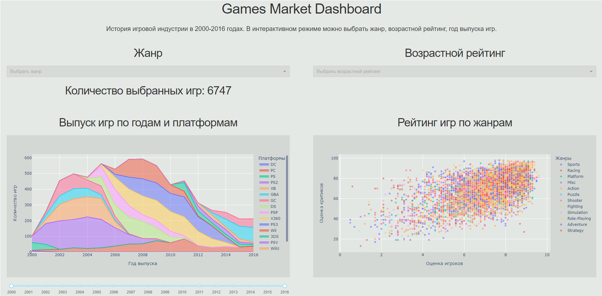

# Dashboard Games Market

Пример небольшого дашборда выполненного с использованием Dash,Plotly и Pandas. Интересный open source подход для замены платных BI-систем.

В качестве данных использовался датасет games.csv, в котором описана история состояний игровой индустрии до 2016 года.
Структура датасета:

- name - название проекта;
- platform - платформа;
- year_of_release - год выпуска;
- genre - жанр игры;
- critic_score - оценка критиков;
- user_score - оценка игроков;
- rating - возрастной рейтинг.

На дашборде можно отфильтровать выпущенные игры по жанру, возрастному рейтингу и временному итнтервалу.

Дашборд загружен на heroku для удобства просмотра:

https://dashboard-games-market.herokuapp.com/

